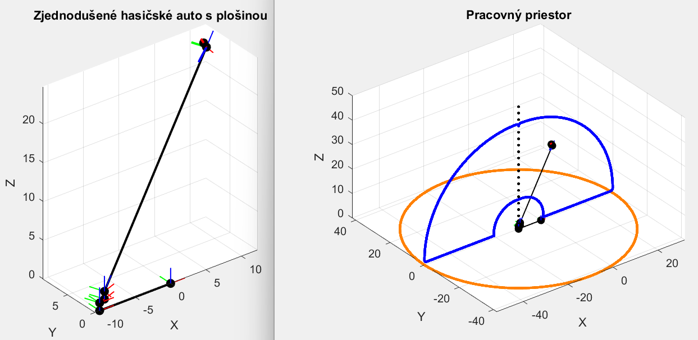

# Pracovny-priestor-plosiny-na-hasicskom-aute
Toto je moje vypracovanie prvého zadania z predmetu Robotika (druhý ročník, letný semester). Je to vizualizácia pracovného priestoru hasičského auta s výsuvnou plošinou v Matlabe. Z dvoch skriptov je podstatný skript "PracovnyPriestorVysuvnejPlosiny.m", ten druhý je takmer zbytočný.

Dôležitý [skript](PracovnyPriestorVysuvnejPlosiny.m), menej dôležitý [skript](vypocetT08preVysuvnuPlosinu.m).

Tu je samotné [zadanie](RobZad1.pdf) a tu moja [dokumentácia](zad1_dokumentacia.pdf)

Po spustení v Matlabe sa načrtne jednoduchý model hasičského auta s plošinou, a vizualizácia pracovného priestoru v dvoch rezoch:

